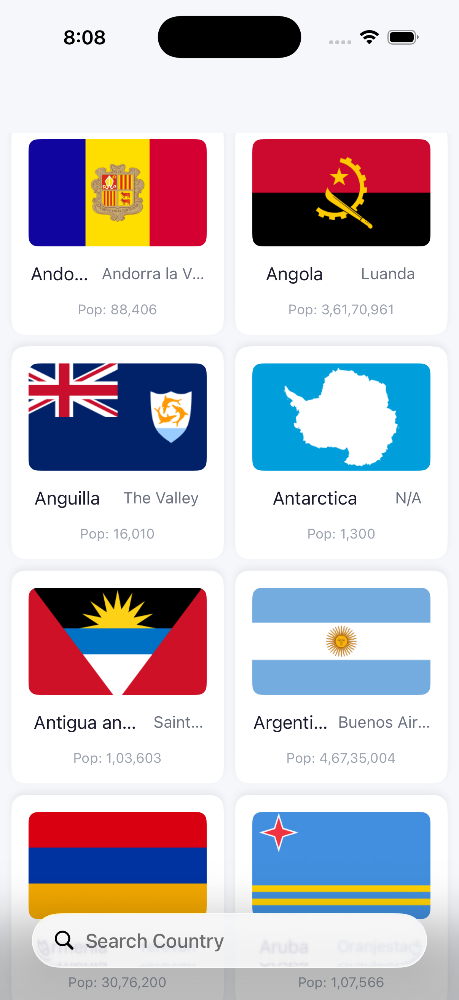
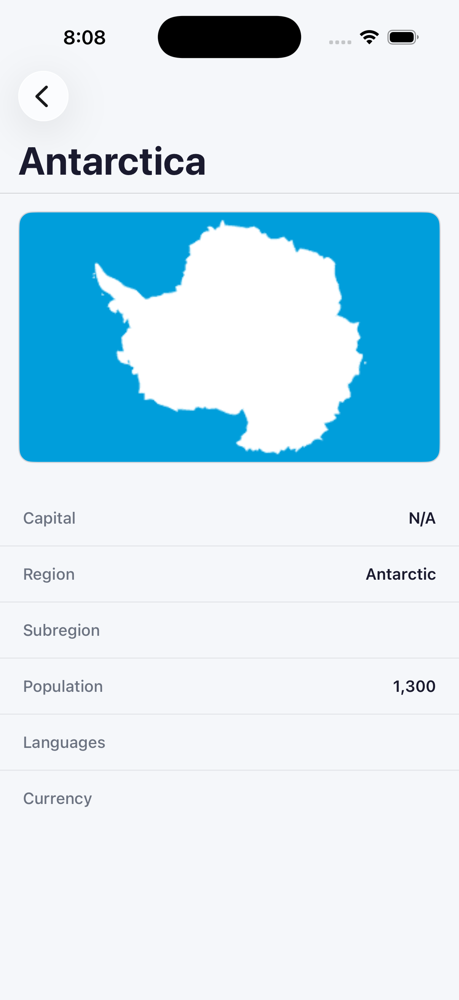
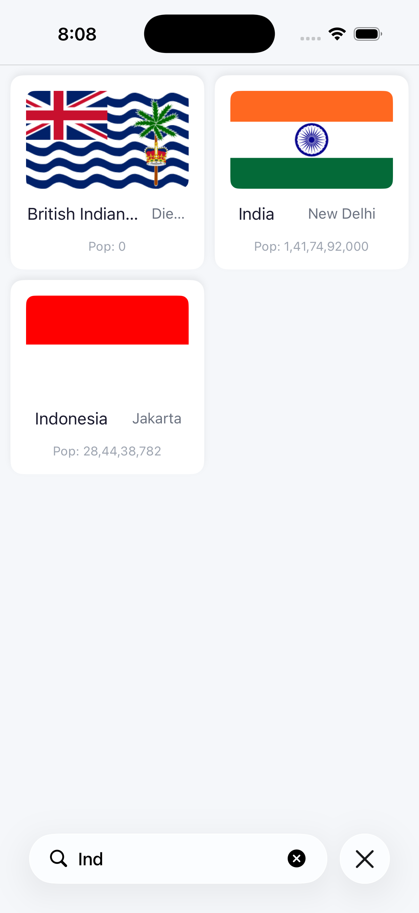

# 🌍 CountryExplorer — iOS Country Explorer App
> App #5 of my iOS Development Journey | Built with Swift + UIKit | Zero Storyboards
 
## 📱 Overview
A fully programmatic iOS app that fetches live country data from a REST API — flags, capitals, populations, and more — with real-time search and async image loading.
 
---
 
## 🖥️ Screenshots
 
| Country List | Country Detail | Search |
|---|---|---|
|  |  |  |
 
---
 
## 🖥️ Screens
- **Country List** — Custom `CountryCell` (flag, name, capital, population) · loading indicator · error state · alphabetical sort · real-time search
- **Country Detail** — Large flag · name, capital, population, region, subregion, languages, currencies
## ⚙️ Features
| Feature | Detail |
|---|---|
| Live API data | `restcountries.com/v3.1/all` — no hardcoding |
| Nested Codable decoding | `CountryName`, `CountryFlag` structs |
| Async image loading | Background thread fetch · main thread UI update |
| Image caching | Flags cached — no re-downloading on scroll |
| Real-time search | `UISearchController` · dual array filtering |
 
## 🛠️ Tech Stack
Swift · UIKit · Programmatic UI · `URLSession.dataTask` · `JSONDecoder` + `Codable` · `DispatchQueue.main.async` · Singleton (`NetworkManager`) · `UISearchController` · `UINavigationController`
 
## 🧠 Concepts Practiced
`Codable` / `Decodable` · Nested JSON decoding · `URLSession.dataTask` · `JSONDecoder` · `DispatchQueue.main.async` · Async image loading · Image caching · `UIActivityIndicatorView` · `UISearchController` · Dual array filtering · Data passing to detail VC
 
## 🌐 API
```
https://restcountries.com/v3.1/all
```
Fields — `name`, `capital`, `population`, `flags`, `region`, `subregion`, `languages`, `currencies`
 
## 🚀 Getting Started
```bash
git clone https://github.com/vermagagan/CountryExplorer-iOS.git
```
Open `CountryExplorer.xcodeproj` in Xcode · Run on iOS 16+ · No dependencies.
 
## 👨‍💻 Author
**vermagagan** · Aspiring iOS Developer · Building in public
[](https://linkedin.com/in/vermagagan) [](https://github.com/vermagagan)
 
> *"Live REST API, nested Codable decoding, async image loading, and zero storyboards."*
